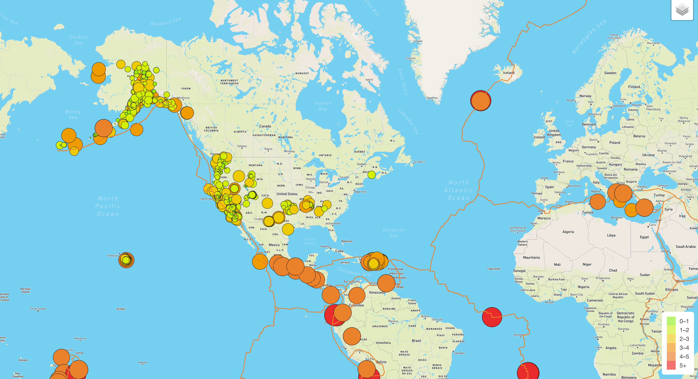
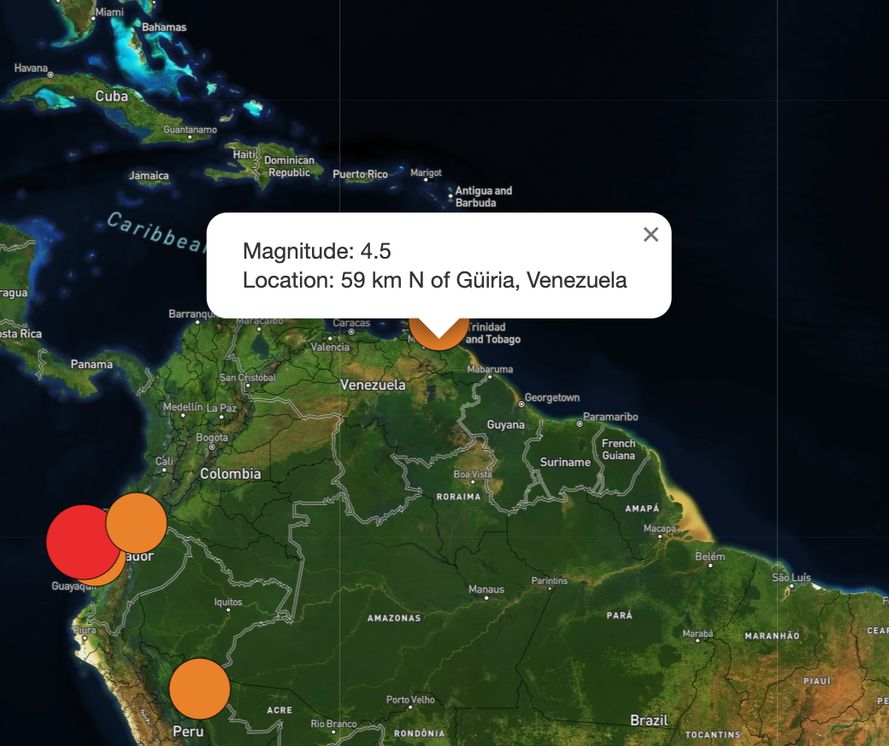

# Mapping-Earthquakes

## Overview

This project maps Earthquake data from all across the world. In addition, this repository serves as a tutorial for mapping data with Leaflet. 

## Images

When first opened, the map has the following default appearance. Each circle represents an earthquake, with the size and color measuring its magnitude. The jagged lines represent the tectonic plates. Notice that the majority of earthquakes align with the tectonic plates.

In the top right corner, the user can change the map view and which data is plotted. When only the "Major" option is selected, only major earthquakes are displayed. 

When the user clicks on a marker, the magnitude and location of the Earthquake is displayed.

